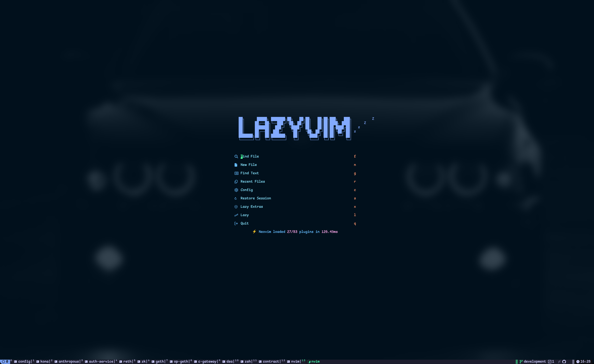
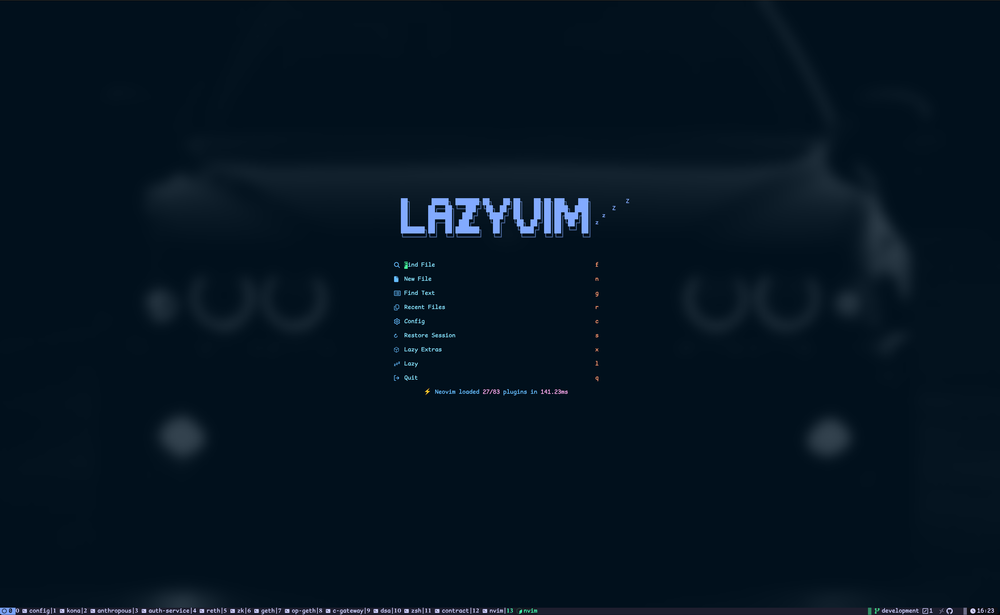

## Cyber-Carbon Tmux

A clean, high-performance Tmux theme following the **Cyber-Carbon** palette (inspired by Gruvbox). This theme features dynamic Git status coloring, highly customizable number styles, and deep integration with GitHub/GitLab.

## Requirements

This theme has the following hard requirements:

- **Homebrew Bash 4.2+**: macOS users must use `brew install bash` as the default system Bash (3.2) does not support associative arrays.
- **Nerd Fonts (v3.0+)**: Required for all icons and symbols.
- **bc & jq**: Required for Git status and advanced widgets.

## Installation

Add this to your `.tmux.conf`:

```tmux
set -g @plugin 'your-username/cyber-carbon-tmux'

```

Alternatively, to run it manually:

```tmux
run-shell "/opt/homebrew/bin/bash ~/path/to/cyber-carbon.tmux"

```

## Configuration

> **Note**: All configuration settings **must** be placed before the `run-shell` or TPM initialization line in your `.tmux.conf`.

### Theme & Transparency

```tmux
set -g @cyber-carbon_theme "hard"       # Options: hard | medium | soft
set -g @cyber-carbon_transparent 1     # 1 to enable transparency, 0 to disable

```

### Number Styles

Customize the look of window and pane indexes. The `medium` and `thin` styles offer a more compact look than standard numbers.

```tmux
# Options: medium | thin | super | sub | hsquare | fsquare | arabic | dsquare
set -g @cyber-carbon_window_id_style "medium" # this is the default.
set -g @cyber-carbon_pane_id_style "super"
set -g @cyber-carbon_zoom_id_style "super"

```

### super font example



### Icons

```tmux
set -g @cyber-carbon_terminal_icon ""
set -g @cyber-carbon_active_terminal_icon ""

```

## Features

### Dynamic Git Status

The status bar automatically monitors your Git repository state:

- **Red Text**: Uncommitted changes detected (Dirty).
- **Green Text**: All changes committed (Clean).
- **Update Rate**: Refreshes every 1 second for real-time feedback.

### Advanced Forge Widgets

Integrates with `gh` (GitHub) and `glab` (GitLab) to show:

-  Pull Request counts
-  Pending reviews
-  Open issues
-  Active bugs (filtered by labels)

## Snapshots

---

**Would you like me to help you set up the specific GitHub/GitLab labels for the bug tracker widget to work correctly?**

### Snapshots



